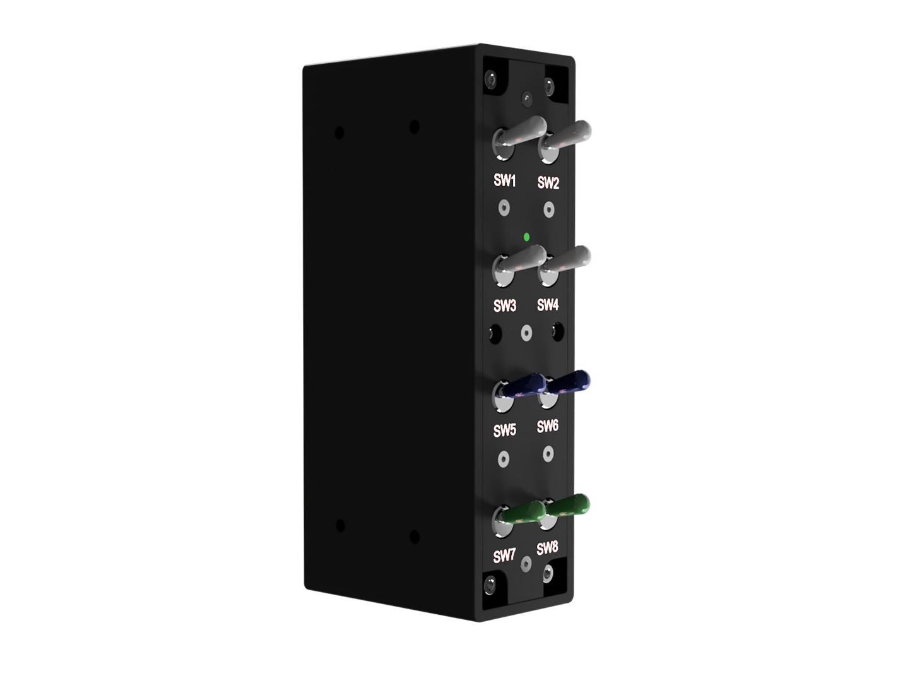

# Nobs Panel

A build-it-yourself switch panel for flight simulators: **8 toggle switches** wired to an
**Arduino Nano ESP32**. It plugs in over USB and shows up as a standard game controller (HID
gamepad) named **"Nobs Panel"**, recognised directly by MSFS and the Nobs app with no drivers to
install.

SW1–SW6 are 2-position (ON-ON) and SW7–SW8 are 3-position (ON-OFF-ON); each switch's two outer
terminals are reported as two buttons, for **16 buttons** total.



## Design Philosophy

**This panel is built for tactile, no-fuss control**: real mechanical toggles instead of a
touchscreen or software panel, so you always know a switch's state by feel alone, no looking
needed, which also makes it VR-friendly. Because it enumerates as a plain USB game controller,
there's nothing to install and nothing that can fall out of sync with a sim update:
* **Physical Switches, Not Software:** Every switch is a genuine toggle with a positive snap, so
  flipping it is unambiguous even without looking.
* **Driver-Free by Design:** The board presents itself as a standard HID gamepad, so MSFS and the
  Nobs app recognise it the moment it's plugged in.

## Docs

- **[Build instructions](docs/build-instructions.md)**: step-by-step assembly, photos included.
- **[Which wire goes where](docs/arduino-esp-32-wiring.md)**: the button + pin map. For a visual
  reference alongside it, see the [wiring diagram](docs/wiring-diagram.pdf).
- **[Loading the firmware](firmware/arduino_eps32_nano/README.md)**: first-time flashing and
  re-flashing, step by step.
- **[Left-mount variant](firmware/arduino_eps32_nano_left/README.md)**: a version wired for mounting
  on the **left** side of a frame, with its own [wiring map](docs/arduino-esp-32-wiring-left.md). See
  [Mounting orientation](#mounting-orientation-left-or-right) below.
- **[Setting the device ID & name](docs/board-identity.md)**: how the board names itself, how to
  rename it, and how to run several panels at once (each gets its own ID + name).
- **[Bill of materials](docs/bill-of-materials.md)**: parts list.

## Mounting orientation (left or right)

The panel comes in two wiring variants so it reads correctly whichever side of a track-racer
T-profile aluminium frame you mount it on:

- **Right mount (standard):** firmware in [`firmware/arduino_eps32_nano/`](firmware/arduino_eps32_nano/),
  wiring in [arduino-esp-32-wiring.md](docs/arduino-esp-32-wiring.md).
- **Left mount:** firmware in [`firmware/arduino_eps32_nano_left/`](firmware/arduino_eps32_nano_left/),
  wiring in [arduino-esp-32-wiring-left.md](docs/arduino-esp-32-wiring-left.md).

The two are identical apart from the switch-to-pin map, which the left variant mirrors for a left
mount: the switch order is reversed (SW1/SW2 swap pin groups with SW8/SW7, and the middle four
mirror too: SW3 with SW6, SW4 with SW5), and each switch's two terminals are swapped so its up/down
isn't inverted by the rotated mount. Both present the same 16 buttons. Pick the firmware and wiring
map that match how you mounted the panel, and don't mix one variant's firmware with the other's
wiring.

Because a left and a right panel can sit in the same rig, they ship with **different default USB
IDs** from the panel's ID block so the simulator never mixes up their bindings: the right (standard)
variant is the 1st panel instance (`80F0` / "Nobs Panel"), the left variant is the 2nd
(`80F1` / "Nobs Panel 2"). See [Setting the device ID & name](#setting-the-device-id--name-in-brief)
and [docs/board-identity.md](docs/board-identity.md) for the full scheme.

## Nobs FS Companion App

The [**Nobs FS app**](https://github.com/ibovegar/nobs-fs-app) is the companion application for
communicating with and configuring this panel. It automatically detects the Nobs Panel by its USB
identity (VID `303A` / PID `80F0`), so the right device is selected even when other game
controllers are connected.

Use it to:
* **Verify wiring & test inputs:** watch every switch register live as you flip it, handy for
  confirming the build before binding anything in the sim.
* **Track multiple panels:** the Devices page lets you add extra instances of the panel, each with
  its own ID and name (see [Setting the device ID & name](#setting-the-device-id--name-in-brief)
  below), so the app and the sim can tell them apart.

See the app repository for installation and usage details: <https://github.com/ibovegar/nobs-fs-app>

## Setting the device ID & name (in brief)

The board's name and USB product ID aren't compiled in; they're stored on the board, so the same
firmware can be set up as any Nobs profile. Out of the box this is **"Nobs Panel"** (`303A` /
`80F0`). To change it, the configuration app sends a single line over the board's serial port:

```
SET_ID:80F0:Nobs Panel
```

The board saves the new name + ID, replies `OK:80F0:Nobs Panel`, and reboots so it takes effect
(`GET_ID` reads back the current values). For multiple panels, give each one the next ID in the
block, e.g. `SET_ID:80F1:Nobs Panel 2`. Full details, including the Windows name-cache refresh,
are in **[docs/board-identity.md](docs/board-identity.md)**.
