# Nobs Panel: Build Instructions

These are the hands-on build steps for the Nobs Panel: how to build the controller board, how to
assemble the enclosure, and how to verify it before binding in the sim. For the project overview,
parts list, and device identity, see the [main README](../README.md).

> For the pin map, see [arduino-esp-32-wiring.md](arduino-esp-32-wiring.md). For a visual
> reference alongside it, see the [wiring diagram](wiring_diagram.pdf).

## Assembly Instructions

Here's how the panel goes together, in order, with a photo of the real build at each stage.
There's soldering involved, so take your time and work in a well-lit, ventilated spot. Don't
rush; it's much easier to get each joint right the first time than to fix it later.

### Building the Controller Board

The controller board is a stripboard carrying the Arduino, pin headers, and screw-terminal blocks
for all the switch wiring.

#### Phase 1: Bare Stripboard

  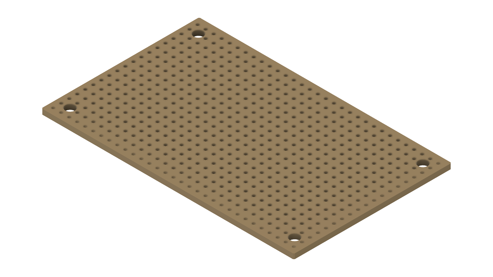

 

* **Start with the Stripboard:** This is the unmodified stripboard the rest of the controller
  board is built on. Copper strips run the full length of the board on the underside.

#### Phase 2: Mount the Pin Headers

  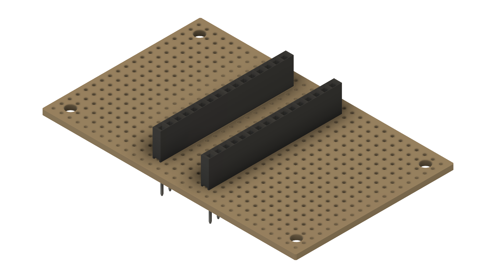

 

* **Solder in the Pin Headers:** Mount the two female pin header rows that the Arduino Nano ESP32
  will plug into, spaced to match the Arduino's footprint.
* **Break the Strip Down the Middle:** The stripboard's copper strips run underneath both header
  rows, which would short the Arduino's top and bottom pin rows together. Cut or score each strip on the bottom side of the stripboard
  in the gap between the two header rows to break that connection before going further.

#### Phase 3: Mount the Terminal Blocks

  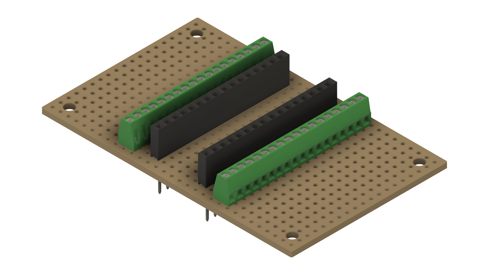

 

* **Solder in the Terminal Blocks:** Mount the screw-terminal blocks alongside the pin headers.
  These are where each switch's signal and ground wires land, per the
  [wiring map](arduino-esp-32-wiring.md).

#### Phase 4: Add the Arduino Nano ESP32

  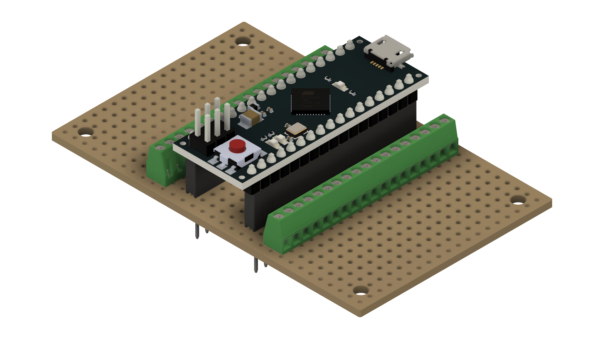

 

* **Plug In the Arduino:** Seat the Arduino Nano ESP32 into the pin headers. The controller board
  is now complete and ready to go into the enclosure.

### Assembling the Enclosure

#### Phase 1: Heat-Set Inserts

  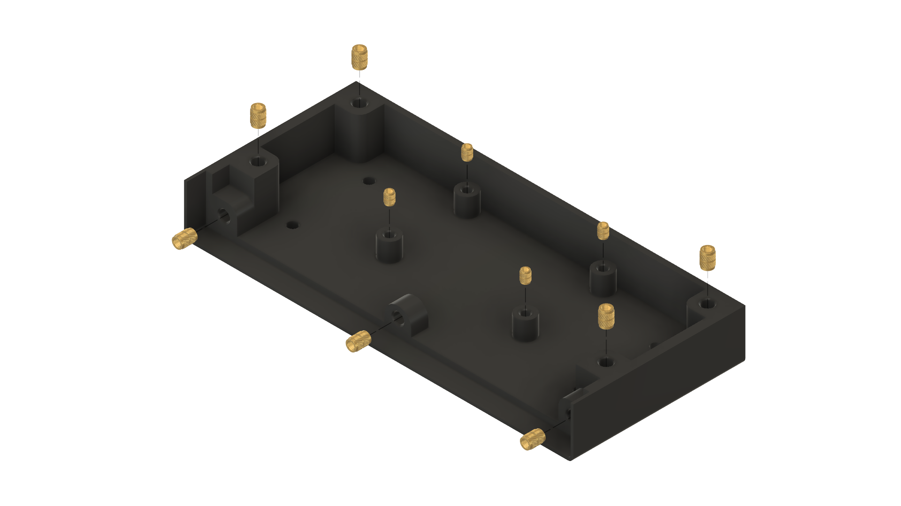

 

* **Press in the Inserts:** Using a soldering iron (or a dedicated insert tool) heated to the
  insert manufacturer's recommended temperature, press each heat-set insert squarely into its
  mounting post in the bottom enclosure. Go in slowly and keep the insert level: a crooked insert
  is the most common mistake here.
* **Do the Top Enclosure Too:** The top enclosure takes the same heat-set inserts in the same way.
  It isn't pictured separately; just repeat this step for it before moving on.

#### Phase 2: Mount the Controller Board to the Bottom Enclosure

  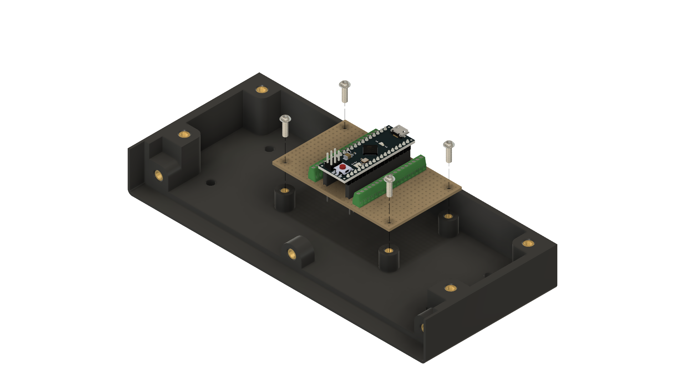

 

  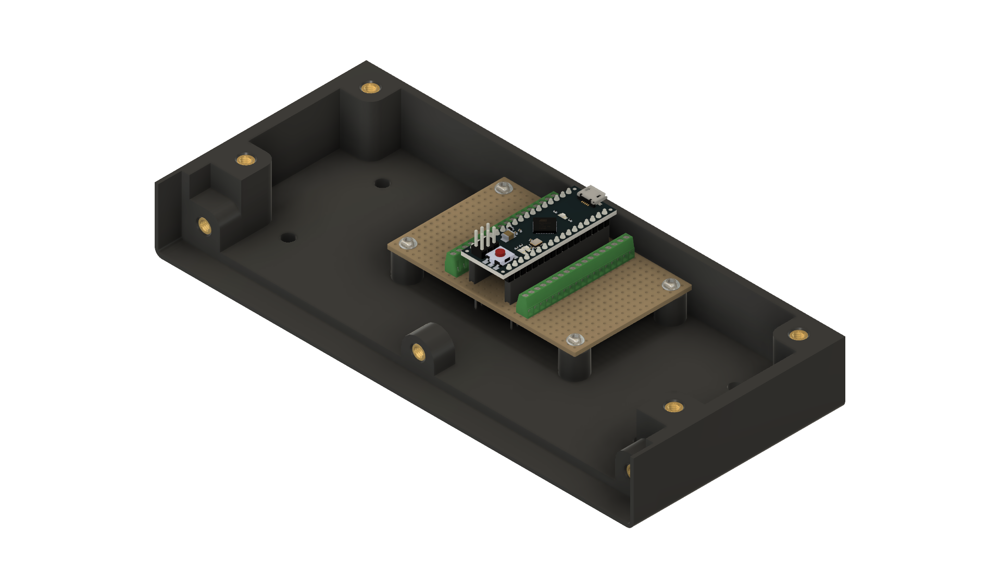

 

* **Secure the Controller Board:** Place the assembled controller board onto its standoffs in the
  bottom enclosure and fix it down with its mounting screws.

#### Phase 3: Heat-Set Inserts in the Mounting Plate

  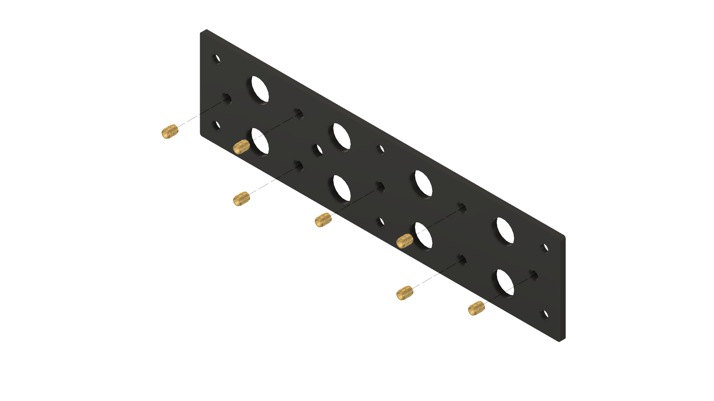

 

* **Press in the Inserts:** Press heat-set inserts into the mounting plate's posts the same way as
  the enclosure halves.

#### Phase 4: Mount the Switches to the Mounting Plate

  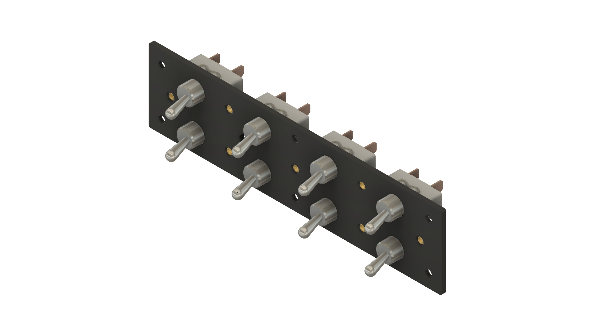

 

* **Place the Switches:** Insert the 8 toggle switches into their cutouts in the mounting plate,
  in the layout shown, and secure each one with its included washer and hex nut, tightened firmly
  by hand. Avoid over-torquing the plastic.

#### Phase 5: Mount the Front Plate to the Mounting Plate

  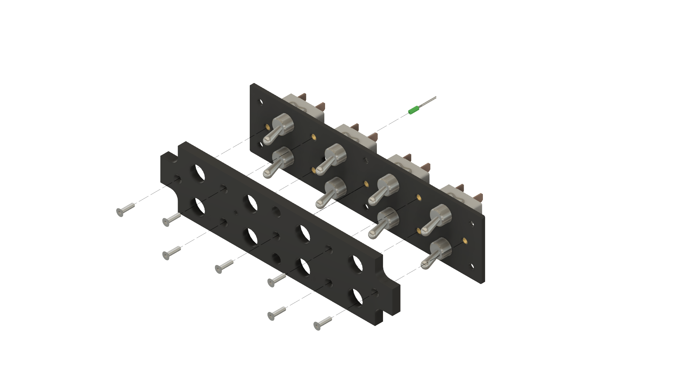

 

* **Join Front Plate to Mounting Plate:** Align the front plate over the switches and secure it to
  the mounting plate with its mounting screws.

#### Phase 6: Mount the Assembly to the Enclosure

  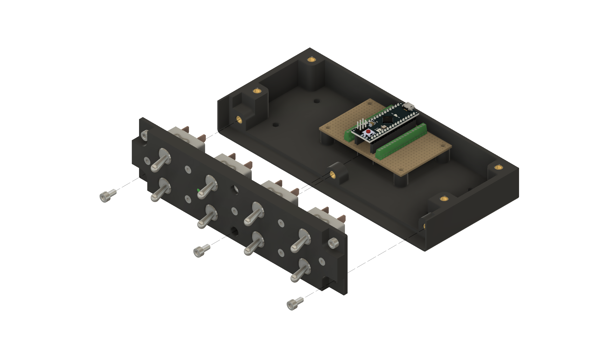

 

* **Wire Up the Switches:** Following the [wiring map](arduino-esp-32-wiring.md), solder a signal
  wire from each switch terminal to its terminal block position on the controller board, and tie
  all the center (ground) terminals together into a common ground harness.
* **Secure the Assembly:** Fix the front plate / mounting plate assembly to the bottom enclosure
  with its mounting screws.

#### Phase 7: Mount the Top Enclosure

  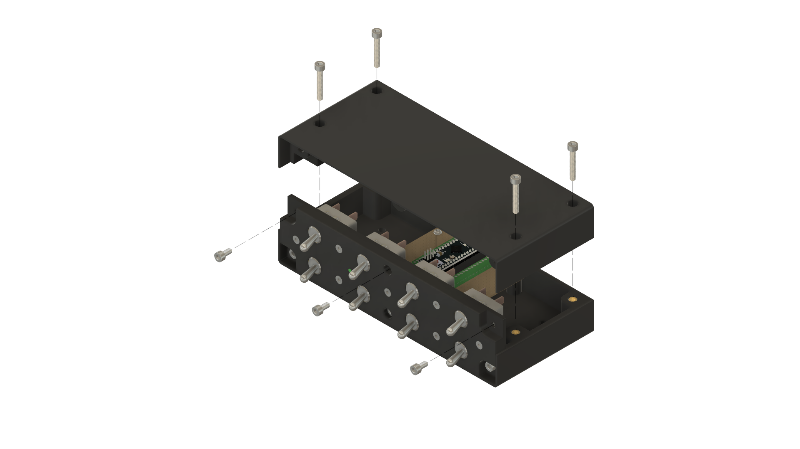

 

* **Secure Case Shells:** Lower the top enclosure onto the bottom half, making sure no wires are
  pinched, and lock the two shells together with their mounting screws.

#### Phase 8: Finished Panel

  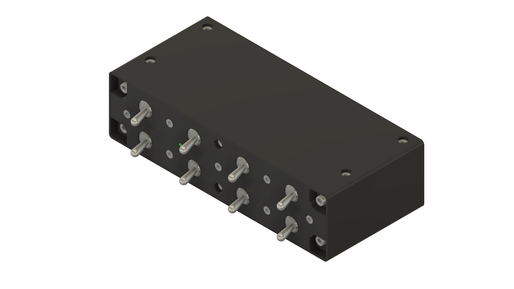

 

That's a complete, assembled Nobs Panel, ready for the verification steps below.

## Verification & First-Time Setup

1. **Check for shorts first (before plugging in USB):** use a multimeter to make sure none of your
   ground wires are accidentally touching a signal wire. This catches wiring mistakes before they
   reach your PC.
2. **Load the firmware:** follow the [Arduino Nano ESP32 firmware guide](../firmware/arduino_eps32_nano/README.md).
3. **Confirm the name:** once plugged in, the panel should show up as `Nobs Panel (Vendor: 303a
   Product: 80f0)`. If it shows a generic name instead, open Windows **Device Manager**, turn on
   **View → Show hidden devices**, uninstall any old listings for the board, and replug it.
4. **Bind it in the sim:** launch MSFS, go to **Options → Control Options**, pick the **Nobs
   Panel** device, and assign each switch position to its desired command.
